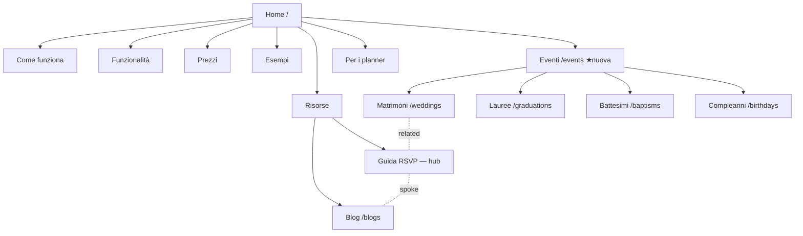

# Site Architecture Ceremly — Design

**Data:** 2026-07-11
**Stato:** approvato (brainstorming con skill marketing site-architecture)
**Riferimenti:** `docs/superpowers/specs/2026-07-10-seo-audit-ceremly-design.md`, `docs/superpowers/specs/2026-07-11-ai-seo-design.md`, `.claude/product-marketing-context.md`

## Obiettivo

Architettura dell'informazione del sito pubblico Ceremly ottimizzata per **SEO organico** su query italiane ("inviti matrimonio digitali", "RSVP online"): gerarchia pagine, navigazione, breadcrumb e internal linking. Implementazione inclusa (non solo documento).

## Decisioni vincolanti (prese in brainstorming)

1. **URL inglesi invariati** — nessuna migrazione a slug italiani (decisione utente, esplicita). Niente `customRoutes` i18n, niente redirect. Vale anche per `/blogs` (plurale anomalo: resta).
2. **Approccio "Hub eventi"** — una sola pagina nuova (`/events`); gerarchia logica a 3 livelli per breadcrumb/linking, URL restano flat.
3. **Perimetro implementazione**: nav header ampliata + breadcrumb UI + internal linking contestuale + pagina hub. Niente altro.
4. `/wedding-planner` resta L1 fuori dall'hub eventi (audience B2B distinta).
5. Niente categorie blog (2 post oggi — YAGNI, rivalutare oltre ~15 post).

## Stato attuale (verificato)

- ~28 pagine pubbliche tutte flat L1; layout `public-site` (CerSiteNav + CerSiteFooter) per le sotto-pagine; homepage `index.vue` con `layout: false` e **nav inline propria** ad anchor in-page.
- Nav header: solo 4 voci (how-it-works, features, pricing, examples). Le pagine evento sono raggiungibili **solo dal footer**.
- Breadcrumb: solo schema JSON-LD su blog + legal (commit bb9593b), nessuna UI.
- `/brand` è orfana (zero link interni in ingresso).
- Piano ai-seo approvato prevede: `/confronta` + `/confronta/[slug]` (4 comparison), `/pricing.md`, `/llms.txt`, potenziamento `/rsvp-guide`, 2-3 blog post. Questa spec **posiziona** quelle pagine nell'architettura ma non le implementa.

## Gerarchia pagine (logica, non URL)

```
Home (/)
├── Come funziona (/how-it-works)
├── Funzionalità (/features)
├── Modelli (/templates)
├── Esempi (/examples)
├── Prezzi (/pricing)
│   └── pricing.md (/pricing.md — machine-readable, piano ai-seo)
├── Eventi (/events)                    ← NUOVA hub
│   ├── Matrimoni (/weddings)
│   ├── Lauree (/graduations)
│   ├── Battesimi (/baptisms)
│   ├── Compleanni (/birthdays)
│   └── [slot futuri: comunioni, cresime — riservati, non creati]
├── Per i planner (/wedding-planner)
├── Confronta (/confronta, /confronta/[slug] — piano ai-seo)
├── Risorse
│   ├── Guida RSVP (/rsvp-guide)        ← hub contenuti RSVP
│   ├── Centro assistenza (/help-center)
│   ├── Blog (/blogs, /blogs/[slug])
│   ├── Changelog (/changelog)
│   ├── Stato servizio (/status)
│   └── API & partner (/api)
├── Ceremly
│   ├── Chi siamo (/about)
│   ├── Contatti (/contact)
│   └── Brand assets (/brand)           ← de-orfanizzata via footer
└── Legal (/legal/tos, /legal/privacy, /legal/cookie, /legal/dpa, /legal/subprocessors)
```

Nota: la gerarchia è **logica** (breadcrumb, linking, nav) — gli URL restano flat. Breadcrumb `Home > Eventi > Matrimoni` con URL `/weddings` è legittimo; canonical e hreflang non cambiano.

### Sitemap visuale (Mermaid)



## Pagina nuova: `/events`

- File `app/pages/events.vue`, layout `public-site`, prerender come le altre pagine pubbliche.
- Contenuto: answer block iniziale 40-60 parole ("inviti digitali per ogni evento" — pattern §1.4 piano ai-seo), card per i 4 tipi evento con anchor descrittivi, cross-link a planner/templates/examples, CTA signup.
- Schema: `ItemList` (i tipi evento) via `useSchemaOrg`.
- Copy IT + EN in `i18n/locales/`.

## Navigation spec

### Header (CerSiteNav)

| # | Voce | Destinazione |
|---|---|---|
| 1 | Come funziona | `/how-it-works` |
| 2 | Funzionalità | `/features` |
| 3 | Per chi ▾ | dropdown: Tutti gli eventi (`/events`), Matrimoni, Lauree, Battesimi, Compleanni, — divider —, Per i planner |
| 4 | Prezzi | `/pricing` |
| 5 | Esempi | `/examples` |
| CTA | Accedi + Registrati | `/login`, `/signup` (gating site-mode invariato) |

- Dropdown: hover su desktop, click su touch, chiusura con Esc, `aria-expanded`/`aria-controls`.
- Mobile (hamburger): "Per chi" diventa gruppo con label + lista piatta (niente accordion annidato).

### Nav homepage

`index.vue` abbandona gli anchor in-page nella nav e adotta gli stessi link a pagine reali del CerSiteNav (dropdown incluso). Motivo: i link interni dalla homepage sono i più forti del sito; gli anchor non passano segnale. Le sezioni della landing restano invariate con i loro CTA in-page. (Approvato in brainstorming rispetto all'alternativa anchor+dropdown.)

### Footer (CerSiteFooter)

4 colonne invariate con aggiunte:

- **Prodotto**: invariata (5 voci)
- **Per chi**: + "Tutti gli eventi" (`/events`) in testa → 6 voci
- **Risorse**: + "Confronta alternative" (`/confronta`) → 6 voci — **solo quando `/confronta` sarà live** (piano ai-seo); non pubblicare link a pagina inesistente
- **Ceremly**: + "Brand assets" (`/brand`) → 6 voci

### Breadcrumb UI

- Nuovo componente `CerBreadcrumb` renderizzato nel layout `public-site` (tutte le sotto-pagine; homepage esclusa).
- Basato su `useBreadcrumbItems` di @nuxtjs/seo → UI visibile e schema `BreadcrumbList` da un'unica fonte.
- Parent logici: pagine evento → `Eventi` (`/events`); tutte le altre → `Home > Pagina`.
- Blog e legal: il breadcrumb sostituisce lo schema-only attuale (evitare doppio JSON-LD BreadcrumbList).

## Internal linking plan

### Hub-and-spoke

1. **`/events`** (hub) ↔ 4 pagine evento + planner. Hub → spoke con anchor descrittivi ("inviti digitali per matrimonio"); ogni spoke → hub (breadcrumb) + 2 spoke affini.
2. **`/rsvp-guide`** (hub contenuti) ← blog post, pagine evento (sezione RSVP), help-center. La guida → pagine evento, `/features`, blog how-to (quando esisteranno).

### Link contestuali (componente `CerRelatedLinks`)

Componente riusabile: titolo + 3-4 card link, data-driven (mappa per pagina).

| Pagina | Linka a |
|---|---|
| Evento (weddings, graduations, baptisms, birthdays) | templates, examples, rsvp-guide, pricing |
| `/features` | 2-3 pagine evento + how-it-works |
| `/templates`, `/examples` | pagine evento + pricing |
| `/pricing` | how-it-works, examples, confronta (quando live) |
| Blog post | rsvp-guide + 1 pagina evento pertinente |
| `/confronta/[slug]` | pricing, features (già previsto dal piano ai-seo) |

Regole: anchor text descrittivi (mai "clicca qui"), le pagine ad alto valore (events, pricing, rsvp-guide) ricevono più link in ingresso.

### Fix orfani

- `/brand` → link dal footer (colonna Ceremly).
- Audit in fase piano: ogni pagina pubblica deve avere ≥1 link interno in ingresso oltre nav/footer.

## Implementazione tecnica

- **Nuovi componenti**: `CerBreadcrumb`, `CerRelatedLinks`, dropdown in `CerSiteNav`; pagina `app/pages/events.vue`.
- **Modifiche**: `CerSiteNav.vue` (dropdown), `CerSiteFooter.vue` (3 voci nuove), `index.vue` (nav → pagine reali), layout `public-site.vue` (breadcrumb), pagine evento/prodotto (CerRelatedLinks), blog/legal (rimozione BreadcrumbList schema-only manuale).
- **i18n**: copy nuova IT + EN (gotcha `@` nei messaggi vue-i18n: verificare con build, non solo dev).
- **Schema**: `ItemList` su `/events`; `BreadcrumbList` via `useBreadcrumbItems`.
- **Sitemap/robots**: `/events` auto-scoperta dal modulo sitemap; nessun cambio config; zero redirect (nessun URL cambia).
- **Route rules**: prerender per `/events` coerente con le altre pagine pubbliche.

## Fuori scope (esplicito)

- Migrazione URL (italiani, `/blogs`→`/blog`) — esclusa per decisione utente.
- Implementazione pagine `/confronta`, `/pricing.md`, `/llms.txt`, potenziamento rsvp-guide, blog post — già coperti dal piano ai-seo.
- Categorie blog.
- Creazione pagine comunioni/cresime (solo slot logici riservati nell'hub).
- Modifiche a dashboard, auth, API backend.

## Verifica

- `pnpm typecheck` + `pnpm build` verdi (build obbligatoria per il gotcha i18n `@`).
- Output prerender di `/events`: canonical self-referencing, hreflang IT↔EN reciproci, `ItemList` presente.
- BreadcrumbList valido (Rich Results Test / validator schema.org) e **non duplicato** su blog/legal.
- Nav: dropdown accessibile (tastiera + `aria-*`), hamburger mobile funzionante.
- Link audit: nessun 404 interno, `/brand` non più orfana.
- Nessuna regressione honesty (no social proof inventata — memoria `ceremly-fake-social-proof`).

## Rischi

| Rischio | Mitigazione |
|---|---|
| Copy i18n rompe il build (`@` gotcha) | Build di verifica obbligatoria |
| Doppio BreadcrumbList (UI nuova + schema manuale esistente) | Rimozione esplicita dello schema manuale su blog/legal nello stesso PR |
| Dropdown nav regressione mobile | Test manuale hamburger + tastiera prima del commit |
| Footer link a `/confronta` prima che esista | Voce footer condizionata alla messa live delle comparison (piano ai-seo) |
